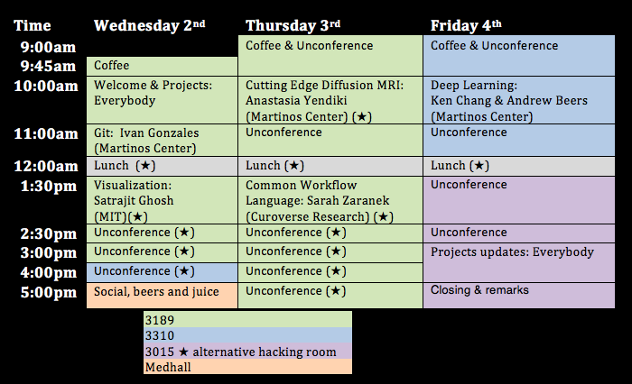

## BrainHack Boston 2018

May 2-4, 2018 | [Building 46 - MIT](https://goo.gl/maps/FPdnf5G9rEE2) | [Register](https://goo.gl/de4J2P)

Organized in coordination with [BrainHack Global 2018](http://www.brainhack.org/global2018/)

### About

*Brainhack Global* is a unique conference that convenes researchers from across the globe and a myriad of disciplines to work together on innovative projects related to neuroscience.

### Schedule

### Projects
- [Realtime processing of BOLD data](projects.md#realtime-visualizationanalysis-of-bold-data)
- [FreeSurfer and CWL](projects.md#freesurfer-and-the-common-workflow-language)
- [Nipype](projects.md#nipype)
- [Tracula and FreeSurfer cortical thickness](projects.md#tracula-and-freesurfer-cortical-thickness)
- [Group short connection streamlines based on cortical structures](projects.md#group-short-connection-streamlines-based-on-cortical-structures)
- [Streamline visualization](projects.md#streamline-visualization)
- [RegTest](projects.md#regtest)
- [Hacking the scientists brains](projects.md#hacking-the-scientists-brains)
- [DICOM outputs for FreeSurfer](projects.md#dicom-outputs-for-freesurfer)

See the [projects page](projects.md) for details

### Set up your laptop

See the [setup page](setup.md) to learn how to install software we will use during the conference.

### Contribute
- [Register](https://goo.gl/de4J2P)
- Submit [project](projects.md) ideas
- [Post flyers](brainhack-boston-2018.pdf)

### Resources

- [BrainHack 101](https://brainhack101.github.io)
- [An Intro to Git and GitHub for Beginners](https://product.hubspot.com/blog/git-and-github-tutorial-for-beginners)
- [More github resources](https://guides.github.com/)
- [A Docker tutorial for beginners](https://docker-curriculum.com/)
- [ReproNim: A Center for Reproducible Neuroimaging Computation](http://www.reproducibleimaging.org/#training)
  - [Version control systems](http://www.reproducibleimaging.org/module-reproducible-basics/02-vcs/)
  - [Reproducible computational environments](http://www.reproducibleimaging.org/module-dataprocessing/04-containers/)
- [NeuroLinks](https://brainhack101.github.io/neurolinks/)
- [NeuroData](https://neurodata.io/)

###  Conduct

[Brainhack is dedicated to providing a harassment-free conference experience for everyone.](http://www.brainhack.org/global2018/codeofconduct.html)

### Contact

- Email: `brainhackboston@gmail.com`
- Slack: [join the brainhack workspace](https://brainhack-slack-invite.herokuapp.com/), then add the channel `#bhg18-boston`
